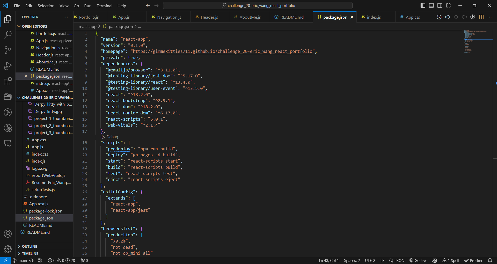
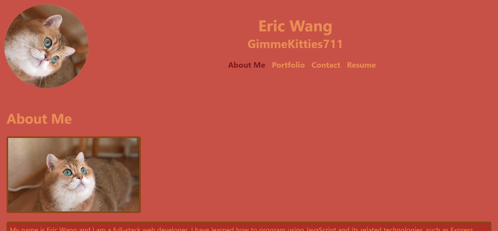
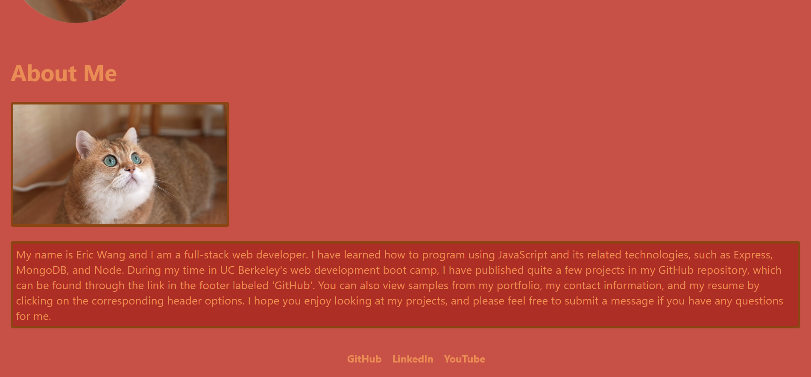
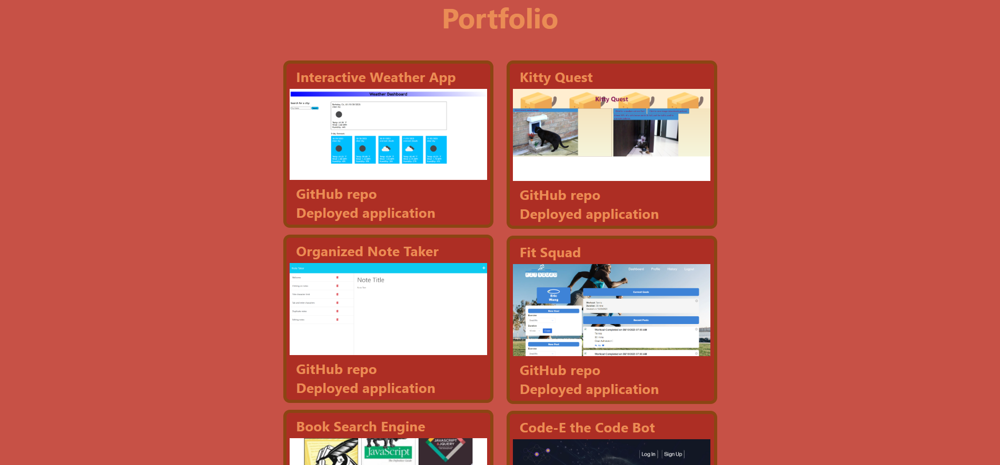
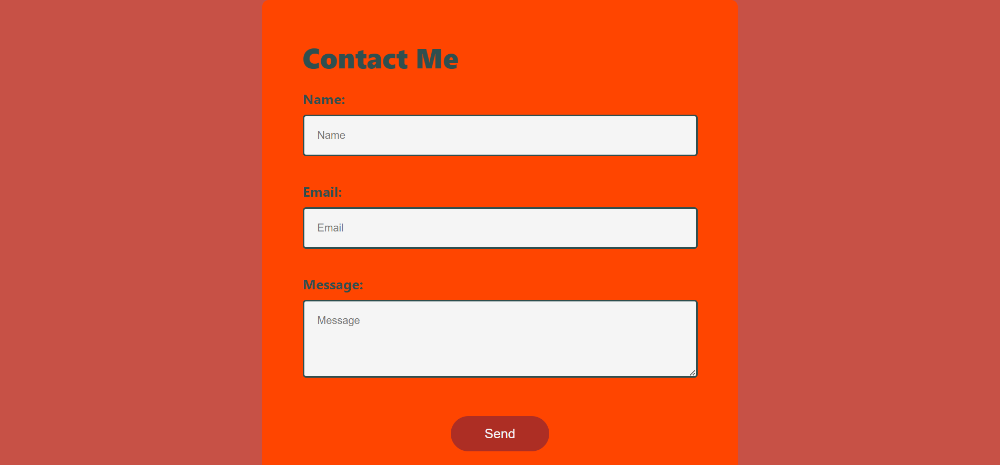

# Challenge 20

## Description
It is important to have a place to compile your most recent professional materials so that fellow developers can see the work you have done and employers can gauge your skills. This project uses React to create a dynamic portfolio that can render sections of content without reloading the page. I learned how to use components to simplify page layout, work with useState() to track user input in real time, and validate form input.

## Table of Contents
- [Description](#description)
- [Installation](#installation)
- [Usage](#usage)
- [Credits](#credits)
- [Contributing](#contributing)
- [Tests](#tests)
- [License](#license)
- [Questions](#questions)

## Installation
Open the `package.json` file in the Integrated Terminal and run `npm install` to install the packages shown in the `dependencies` section of the following screenshot:

You will also install the dev dependency `gh-pages @6.0.0`.

## Usage
The deployed application can be found [here](https://gimmekitties711.github.io/challenge_20-eric_wang_react_portfolio/).

The portfolio features the following sections:

**Header:** You can use this component to navigate between different parts of the page. The component that you are currently viewing will be highlighted.

**About Me and Footer:** The About Me section features my GitHub profile picture and a paragraph about my professional background and the work that I have done. The footer features three links, `GitHub`, `LinkedIn`, and `YouTube`. Clicking these links will take you to my profiles on the corresponding sites.

**Portfolio:** This section features six of the projects that I have completed during my time in the boot camp. Each project card contains links to the corresponding GitHub repository and deployed application.

**Contact:** This section features a contact form where you can enter your `Name`, `Email`, and `Message`. All three fields are required, and your email address must be in a valid format, for example `green@gmail.com`. Once all of the requirements have been met, you can click the `Send` button and I will receive an email. **Serious inquiries only, no spamming please.**

**Resume:** This section lists my Front-end skills, Back-end skills, and General skills. You can also download my resume by clicking the `Download my resume` button. The filename will be `Resume-Eric_Wang.pdf`. If you download the file more than once, the file names will be `Resume-Eric_Wang (1).pdf`, `Resume-Eric_Wang (2).pdf`, etc.

## Credits
Received assistance in Slack from students Kevin Smith and Michael Taraschi, TA Michael Seaman, and instructor Robbert Wijtman.

The following web resources helped me write the code for this project:

https://stackoverflow.com/questions/75728532/uncaught-typeerror-cannot-destructure-property-basename-of-react2-usecontext
https://youtu.be/wfGjDGpPVg4?si=zMjoXgOdPmwZBl1N
https://youtu.be/nRDjGOVUqCM?si=qJKeRSe6-EN-qMYx
https://youtu.be/7-Iy4jtaHBc?si=nDm8wRBXojLIOKnU
https://www.quackit.com/css/color/values/css_hex_color_notation_8_digits.cfm
https://coolors.co/
https://getcssscan.com/blog/how-to-remove-bullets-from-li-css
https://www.youtube.com/watch?v=sGQSz22U8VM
https://www.w3schools.com/cssref/pr_outline.php
https://stackoverflow.com/questions/55313748/download-file-by-clicking-a-button-in-reactjs
https://www.youtube.com/watch?v=IkMND33x0qQ
https://www.youtube.com/watch?v=pJiRj02PkJQ
https://www.youtube.com/watch?v=bMq2riFCF90
https://www.emailjs.com/docs/examples/reactjs/

## Contributing
The form does not work as I would like it to. The warning message appear when the cursor leaves the input fields, but they do not disappear when the user begins typing text. If someone could help me resolve this issue, I would greatly appreciate it.

## Tests
No tests have been written for this application.

## License
No license is attached to this repository.

## Questions
If you have any questions for me, you can [follow me on GitHub](https://github.com/GimmeKitties711) or email me at eric20wang.wang@gmail.com.
