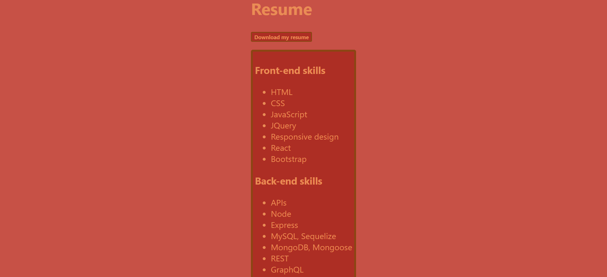

# Challenge 20: Professional Portfolio with React

## Description
It is important to keep your updated professional materials in one place so that other developers can see the work you have done and potential employers can assess your skills. This project uses React to create a dynamic portfolio that can render sections of content without reloading the page. I learned how to use React components to build the page layout, track user input in real time with `useState()`, and validate form input.

## Table of Contents
- [Description](#description)
- [Installation](#installation)
- [Usage](#usage)
- [Credits](#credits)
- [Contributing](#contributing)
- [Tests](#tests)
- [License](#license)
- [Questions](#questions)

## Installation
Get started by opening the `package.json` file in the Integrated Terminal and running `npm install`. This action will install the packages shown in the `dependencies` section of the following image:

You will also install the dev dependency `gh-pages @6.0.0` (not shown).

## Usage
The deployed application can be found [here](https://gimmekitties711.github.io/challenge_20-eric_wang_react_portfolio/).

My portfolio features the following sections:

**Header:** You can use the navigation options to view different components of the page. The one that you are currently viewing will be highlighted.

**About Me and Footer:** The `About Me` section features my GitHub profile picture and a paragraph about my skill set and the work that I have done. The footer features three links, `GitHub`, `LinkedIn`, and `YouTube`. Clicking these links will take you to my profiles on the corresponding sites.

**Important:** All links open in a new tab.

**Portfolio:** This section features six of the projects that I completed during my time in the boot camp. Each project card contains links to the corresponding GitHub repository and deployed application.

**Contact:** This section features a contact form where you can enter your `Name`, `Email`, and `Message`. All three fields are required, and your email address must be in a valid format, for example `green@gmail.com`. Once all of the input requirements have been met, you can click the `Send` button and I will receive an email containing the information you submitted. **Serious inquiries only, no spamming please.**

**Resume:** This section lists my front-end skills, back-end skills, and general skills. You can download my resume by clicking the `Download my resume` button. The file name will be `Resume-Eric_Wang.pdf`. If you download the file more than once, the file names will be `Resume-Eric_Wang (1).pdf`, `Resume-Eric_Wang (2).pdf`, and so on.

## Credits
Received assistance in Slack from students Kevin Smith and Michael Taraschi, TA Michael Seaman, and instructor Robbert Wijtman. Also received help from AskBCS assistants Kumar, Shane, and Youssef.

The following web resources helped me write the code for this project:

1. [Stack Overflow: Why BrowserRouter needs to be used with Link](https://stackoverflow.com/questions/75728532/uncaught-typeerror-cannot-destructure-property-basename-of-react2-usecontext)
2. [YouTube: React part 1: JSX and Babel](https://youtu.be/wfGjDGpPVg4?si=zMjoXgOdPmwZBl1N)
3. [YouTube: React part 2: create-react-app and React Components](https://youtu.be/nRDjGOVUqCM?si=qJKeRSe6-EN-qMYx)
4. [YouTube: React part 3: Children and event handling](https://youtu.be/7-Iy4jtaHBc?si=nDm8wRBXojLIOKnU)
5. [Meaning of an 8-digit hex code](https://www.quackit.com/css/color/values/css_hex_color_notation_8_digits.cfm)
6. [Coolors](https://coolors.co/)
7. [How to remove bullet points from an unordered list](https://getcssscan.com/blog/how-to-remove-bullets-from-li-css)
8. [YouTube: How To Make Working Contact Form With JavaScript | Receive Form Data On Email](https://www.youtube.com/watch?v=sGQSz22U8VM)
9. [The CSS outline property](https://www.w3schools.com/cssref/pr_outline.php)
10. [Stack Overflow: How to create a file download button in React](https://stackoverflow.com/questions/55313748/download-file-by-clicking-a-button-in-reactjs)
11. [YouTube: Full React Tutorial #27 - Controlled Inputs (forms)](https://www.youtube.com/watch?v=IkMND33x0qQ)
12. [YouTube: Full React Tutorial #28 - Submit Events](https://www.youtube.com/watch?v=pJiRj02PkJQ)
13. [YouTube: React: Send email from contact form without server code - Email.js Tutorial](https://www.youtube.com/watch?v=bMq2riFCF90)
14. [EmailJS documentation](https://www.emailjs.com/docs/examples/reactjs/)

## Contributing
No contribution is necessary for this project.

## Tests
No tests have been written for this application.

## License
No license is attached to this repository.

## Questions
If you have any questions for me, you can [follow me on GitHub](https://github.com/GimmeKitties711) or email me at eric20wang.wang@gmail.com.
